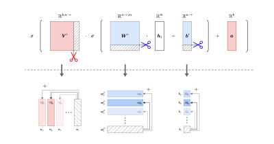
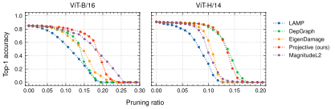
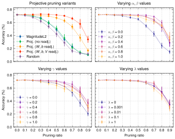

# Projective Pruning for Decoupling Weights

This repository contains the official implementation and experimental code for **Projective Pruning**, a neural compression method submitted to [ECML PKDD 2025](https://ecmlpkdd.org/).



## Overview

**Projective Pruning** is a structured weight pruning technique that eliminates highly correlated parameters to achieve model compression and acceleration. Unlike traditional magnitude-based pruning, our method employs **linear projection** to rank and prune groups of parameters while maintaining model expressivity through a **redistribution mechanism**. The approach is validated across various neural architectures, including **ResNet, VGG, MobileNet, PointNet, DGCNN, and GPT-2**, on multiple standard benchmark tasks.

## Implementation Details

A direct implementation of the methodology described in the paper (as in [projprune/naive_minimal.py](projprune/naive_minimal.py)) is computationally infeasible due to the complexity of solving normal equations iteratively. To make **Projective Pruning** practical, we introduce three key optimizations:

1. **Online weight updates** – Instead of recalculating the normal equations at each pruning step, we use a **coefficient-based redistribution** strategy that maintains valid solutions efficiently throughout the entire pruning process.

2. **Memory-efficient masks and in-place operations** – To avoid excessive memory reallocations, auxiliary matrices are structured using **masks and tensor views** which allows efficient parameter access and modification.

3. **Efficient matrix inversions** – The initial matrix inversion for the first prunable unit needs to be computed explicitly, but all subsequent inversions are evaluated using a formula derived specifically for **rank-1 update**.

For an in-depth technical explanation, refer to the document [projprune/implementation.pdf](projprune/implementation.pdf) and the code [projprune/fast_minimal.py](projprune/fast_minimal.py).

## Repository Structure

```txt
.
├── logs/               # Raw experiment logs
├── run/                # Processed and structured experiment logs
├── engine/             # Implementation of models for pruning
├── torch_pruning/      # Extended torch pruning library
├── scripts/            # Experiment scripts
│   ├── results/        # Processed benchmark results
│   └── master.sbatch   # Main script for ResNet, VGG, and MobileNet experiments
├── vit/                # Vision Transformer (ViT) experiment code (subsection 4.1)
├── gpt2/               # GPT-2 experiment code (subsection 4.2)
├── params/             # Hyperparameter analysis scripts (subsection 4.3)
├── registry.py         # Model registry for the engine/
├── requirements.txt    # Python dependencies
├── main.py             # Main experiment entry point (subsection 4.1)
└── projprune/          # Core implementation of Projective Pruning
    ├── implementation.pdf
    ├── fast_minimal.py
    └── naive_minimal.py
```

## Reproducibility

To ensure full reproducibility, all experiments use **fixed seeds (seed=1)**. The steps below reproduce all results from the paper.

### 1. Data Preparation

#### Automatically Downloaded Datasets

- **Penn Treebank & WikiText-2**: Automatically fetched via [Hugging Face](https://huggingface.co/).
- **CIFAR-10/100 & FashionMNIST**: Downloaded from [torchvision.datasets](https://pytorch.org/vision/0.9/datasets.html).

#### Manually Downloaded Datasets

- **ModelNet40**: Download from [ModelNet](https://modelnet.cs.princeton.edu/), and extract it into `./data/`. Make sure to pull the original **unaligned** version.
- **ImageNet**: Download from [ImageNet](https://image-net.org/) -- select the labeled [ILSVRC2012](https://image-net.org/challenges/LSVRC/2012/2012-downloads.php) subset for Task 1 & 2, and organize it as follows:

```text
train/
├── n01440764/
│   ├── n01440764_10026.JPEG
│   └── ...
├── n01443537/
│   ├── n01443537_10007.JPEG
│   └── ...
└── ...

val/
├── n01440764/
│   ├── ILSVRC2012_val_00000946.JPEG
│   └── ...
├── n01443537/
│   ├── ILSVRC2012_val_00001269.JPEG
│   └── ...
└── ...
```

You can use this [script](https://raw.githubusercontent.com/soumith/imagenetloader.torch/master/valprep.sh) to structure validation data correctly.

### 2. Install Dependencies

Create a virtual/conda environment and install dependencies:

```bash
pip install -r requirements.txt
```

For reproducing GPT-2 and ViT experiments, you need additional dependencies:

```bash
pip install -r gpt2/requirements.txt
pip install -r vit/requirements.txt
```

### 3. Compute Resources

The experiments were primarily conducted on **NVIDIA Tesla V100 32GB**, except for transformer-based models (**ViT, GPT-2**), which required **NVIDIA A100 80GB**, and parameter analysis, which was performed on **NVIDIA Tesla T4**. Due to architectural differences, slight numerical variations may occur across different hardware configurations. To ensure exact reproducibility, refer to the logs in [`logs/`](logs/), where each run specifies the exact GPU used in its header. The complete benchmark suite, including pretraining and fine-tuning of pruned models, was executed sequentially and took approximately **six days** to complete. Logs provide detailed timing information for each experiment.

### 4. Running Experiments

#### VGG, ResNet (CIFAR-10/100) & PointNet (ModelNet40)

All scripts for running benchmarks are located in [`scripts/`](scripts/). To reproduce the results presented in **Table 1**, execute the master [script](scripts/master.sbatch):

```bash
bash scripts/master.sbatch
```

Alternatively, you can run individual experiments for each dataset:

- **CIFAR-10:** [`scripts/cifar10.sh`](scripts/cifar10.sh)  

  ```bash
  bash scripts/cifar10.sh
  ```

- **CIFAR-100:** [`scripts/cifar100.sh`](scripts/cifar100.sh)  

  ```bash
  bash scripts/cifar100.sh
  ```

- **ImageNet:** [`scripts/imagenet.sh`](scripts/imagenet.sh)  

  ```bash
  bash scripts/imagenet.sh
  ```

- **ModelNet40:** [`scripts/modelnet40.sh`](scripts/modelnet40.sh)  

  ```bash
  bash scripts/modelnet40.sh
  ```

To process experiment logs and generate summary tables, use [`scripts/parse_logs.py`](scripts/parse_logs.py):

```bash
python scripts/parse_logs.py
```

All pretraining and pruning logs are in [`run/`](run/). Due to storage limits, PyTorch Module checkpoints are compressed in [`ckpts/`](ckpts/).


#### Vision Transformer (ViT) on ImageNet

To reproduce Vision Transformer (ViT) experiments, navigate to the `vit/` directory, and execute [`vit/launch.sh`](vit/launch.sh):

```bash
cd vit/
bash launch.sh
```

Logs and model checkpoints are stored in [`vit/logs/`](vit/logs/) and [`vit/outputs/`](vit/outputs/). Process the results using [`vit/parse.py`](vit/parse.py).



#### GPT-2 (Penn Treebank, WikiText-2)

For GPT-2 experiments, navigate to the `gpt2/` directory and run [`gpt2/main.py`](gpt2/main.py):

```bash
cd gpt2/
python main.py
```

The results are stored in [`gpt2/results`](gpt2/results).


#### LeNet on FashionMNIST (Parameter Analysis)

For hyperparameter analysis and a comparison of projective pruning variants, open and execute [`params/projprune_analysis.ipynb`](params/projprune_analysis.ipynb).



## Extensibility

This repository is designed for easy modification and future extensions. To create or modify a pruning function, refer to:

- [`torch_pruning/pruner/importance.py`](torch_pruning/pruner/importance.py)
- [`torch_pruning/pruner/algorithms/`](torch_pruning/pruner/algorithms/)

For a comprehensive explanation of the projective pruning methodology, see [`projprune/implementation.pdf`](projprune/implementation.pdf).

## Acknowledgments

Experiments on **CIFAR-10/100** and **ModelNet40** were conducted using the open-source [VainF/Torch-Pruning](https://github.com/VainF/Torch-Pruning) library. We acknowledge the contributors for their work.

<!-- ## Contact

For questions or feedback, please open an issue or contact the authors of **Projective Pruning for Decoupling Weights**. -->
